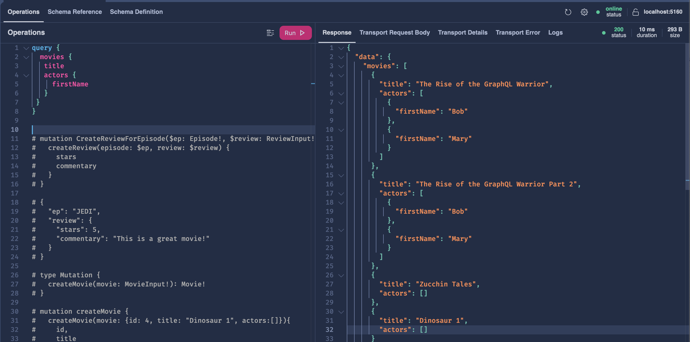
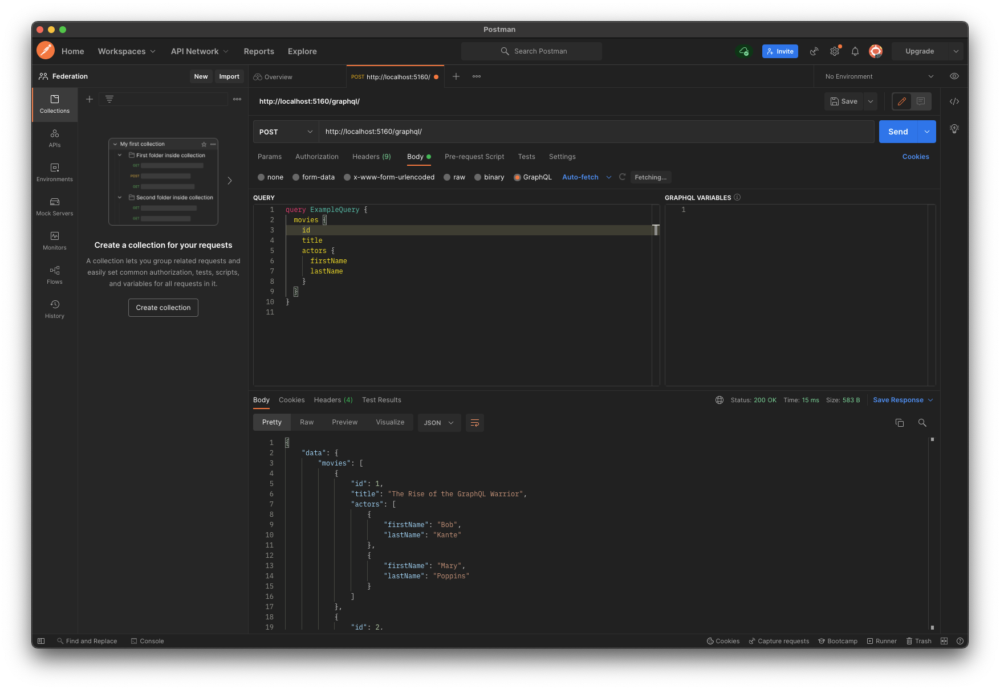
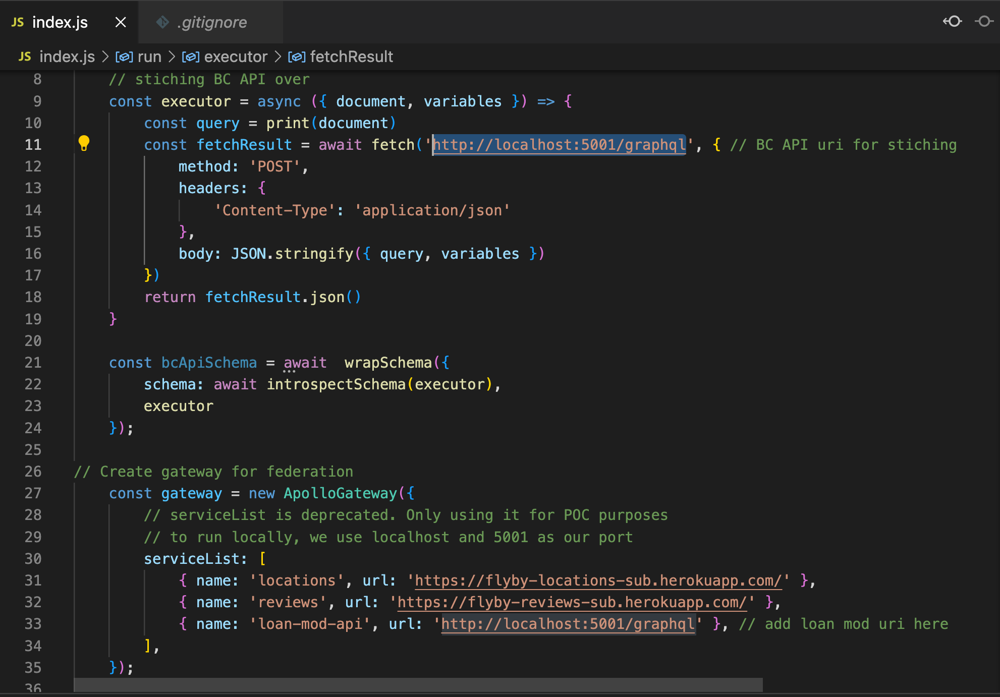
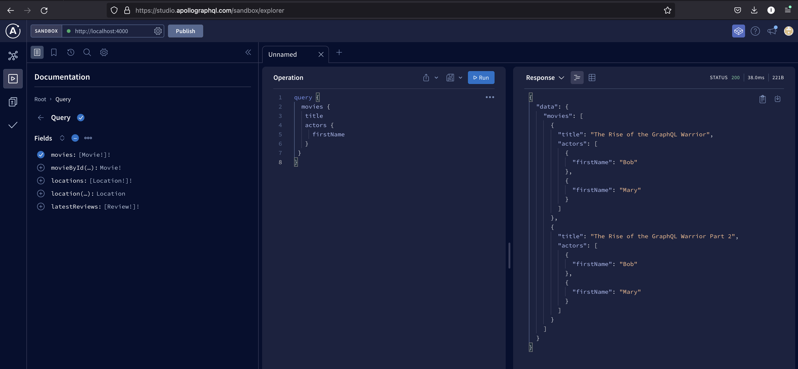

# Project Overview
This is a sample GraphQL API that runs on Hot Chocolate. Our "database" is just some static local data. We created this as a POC in order to act as a subgraph for Apollo. 
# How To Run
- in main directory 'dotnet run'
- Server should start up on localhost:5100/graphql
- Look at queries below 
# Example Query and Mutation
```
query {
  movies {
   title
   actors {
     firstName
   }
 }
}


mutation createMovie {
  createMovie(movie: {id: 4, title: "Avocado Ape", actors:[]}){
    id,
    title
  }
}
```
## What Results should Like:
Through local:

Through Postman:

# Connecting w/ Apollo
- Look at this commit for the setup details in this repo for Apollo (https://github.com/isaacng-boop/dotnet/commit/94208b54d5857985b69fc87e088947a15de09ea7)
- Clone this repository: https://github.com/AndrewVu-DriveTime/apollo-gateway-poc
- Change gateway in index.js to http://localhost:5001/graphql (or whatever your server is running on)

- Run npm install -> npm start (should start at localhost:4000)
- Visit https://studio.apollographql.com/sandbox/explorer and play around. 
